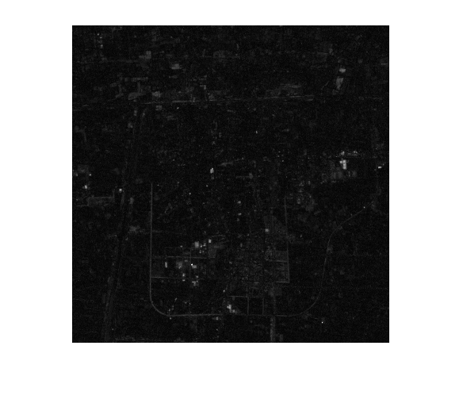
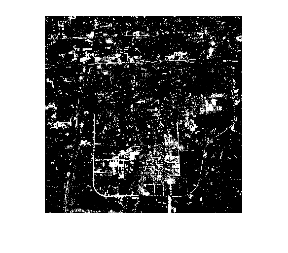
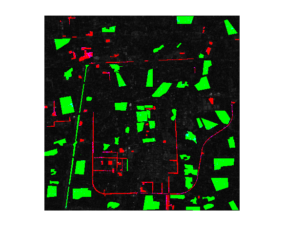
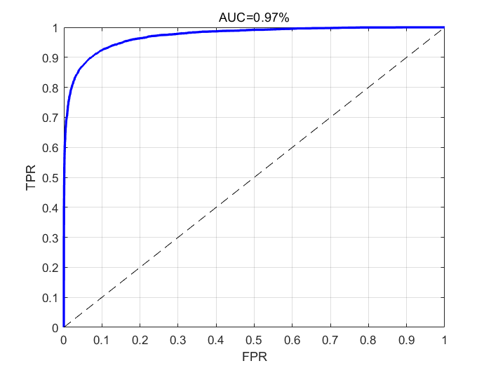

# MATLAB Toolbox for Remote Sensing Change Detection

This repository includes a MATLAB toolbox for **remote sensing change detection** (RSCD) wherein several classical methods are implemented. I'm working on building an open-source, end-to-end, and extensible benchmark framework for the convenience of the RSCD research.

## Overview

Generally, a typical RSCD process can be divided into four steps, namely image pre-processing, change detection, binarization (thresholding) and accuracy evaluation. Currently, the toolbox is mainly based on the final three steps. For ease of usage and maintenance, the toolbox adopted modular design, which was realized by packages and classes in MATLAB semantics.

- The `Datasets` package holds several classes of change detection datasets.
- `Algorithms` collects the change detection methods to yield a difference image.
- `ThreAlgs` contains 3 common methods for binary segmentation.
- `Metrics` groups 6 metrics that are frequently used in researches.

Each of these packages contains replaceable *modules* and the modules from different packages can be freely combined. It is worth mentioning that the modules for pre-processing and post-processing are still under development.

## Dependencies and Environment

The toolbox is developed and tested in MATLAB R2017b.

## Getting Started

For a quick start, use `detectChange.m`. Here are some examples.
```MATLAB
[CM, DI] = detectChange('CVA', {}, 'KMeans', {}, 'data/2000TM', 'data/2003TM')

[CM, DI, results] = detectChange('MAD', {}, 'OTSU', {}, '2000TM.tif', '2003TM.tif', 'gt.png', {'AUC', 'UA'}, {{}, {}})
```

See the usage of `detectChange.m` by
```MATLAB
help detectChange
```

Alternatively, try
```MATLAB
cd UI
run guiCD.m
```

to enable the visual interface.

To try full functionality, find the main script `main.m` in the root directory of this repo, and follow the three steps below:

### Step 1

First, check and set the global configurations. They are in the beginning of the script and most of them are about logging and visualization settings. So feel free to fiddle. See the comment to understand what an option will do.

### Step 2

Second, select the modules you would like to use by specifying their names in quotes. The names have to be valid and exact, which means that a name ought to be taken from the `Name` column of the [**Available Lists**](#available-lists). For the `METRICS`, put any number of items in a `cell` array. An example is here:
```MATLAB
ALG = 'MAD'
DATASET = 'TaizhouDataset'
THRE_ALG = 'KMeans'
METRICS = {'OA', 'UA', 'Recall', 'FMeasure', 'AUC', 'Kappa'}
```

Then, type the arguments by assigning `cell` arrays to `CONFIG_*`. The assignment statements have to be there even if no argument is expected. Otherwise, it wil raise an error. For the zero-argument case, just leave the `cell` empty. Note that for `CONFIG_DATASET`, a *path string* that directs to the root directory of the dataset is always required. For `CONFIG_METRICS`, the arguments of each `CDMetric` module should be specified in separated sub-cells. And the number of the nested cells matches the length of `MRTRICS`. See this example:

```MATLAB
CONFIG_ALG = {1, 2};
CONFIG_DATASET = {'E:\\Mydataset'};
CONFIG_THRE_ALG = {};
% MRTRICS = {'A', 'B', 'C'}
CONFIG_METRICS = {{'a'}, {}, {}};
```

### Step 3

Run the code :rocket:

Here are some visualized results

#### difference image



#### change map



#### prettified results



#### ROC curve



## Demo on AirChange Dataset

Here is a specific example with respect to the SZTAKI AirChange Benchmark set.

To start, download the dataset from [here](http://web.eee.sztaki.hu/remotesensing/airchange_benchmark.html). As notified on the page, you may have to e-mail the author in order to get the password.

Unzip the dataset, and you will get a folder named `SZTAKI_AirChange_Benchmark`.

Open `main.m` in your MATLAB editor and find `DATASET` in line 35. As you'd expect, we should set it to `'AirChangeDataset'`. Then, find the `CONFIG_DATASET` term in line 40. Change the first string within the braces to the absolute path of the unzipped dataset. For example, in my case this should be `'D:\data\CD\Air Change dataset\SZTAKI_AirChange_Benchmark'`.

In lines 34-37, we are able to select the modules. Please check more details in [step 2](#step-2). For a simple test, you can just leave them as they are.

More configuration items can be found from line 5 to line 22. By default, all possible visualization results, including the difference image, the change map, the prettified map, and the ROC curve, will be displayed after each pair is processed. You can toggle the switches (by changing `true` to `false` or vice versa) to disable or enable the outputs. When `GO_PAUSE_MODE` is set to 1 (the default behavior), iterations will not go on until all the opened figures are closed.

## Available Lists

### Datasets

Dataset | Name | Link
:-:|:-:|:-:
SZTAKI AirChange Benchmark set | AirChangeDataset | [link](http://web.eee.sztaki.hu/remotesensing/airchange_benchmark.html)
Bern dataset | BernDataset | 
Onera Satellite Change Detection dataset | OSCDDataset | [link](https://rcdaudt.github.io/oscd/)
Ottawa dataset | OttawaDataset | 
Taizhou dataset | TaizhouDataset | 

### Change Detection Algorithms

Algorithm | Name | Paper
:-:|:-:|:-:
Change Vector Analysis | CVA | [paper](https://www.researchgate.net/publication/37794369_Change_Vector_Analysis_An_Approach_for_Detecting_Forest_Changes_with_Landsat)
Differential Principal Component Analysis | DPCA | [paper](https://www.tandfonline.com/doi/full/10.1080/01431160801950162)
Image differencing | ImageDiff | [paper](https://www.researchgate.net/publication/239063613_Digital_change_detection_techniques_using_remotely_sensed_data)
Image ratioing | ImageRatio | [paper](https://www.researchgate.net/publication/235245895_Change_Detection_Techniques)
Image regression | ImageRegr | [paper](https://www.researchgate.net/publication/235245895_Change_Detection_Techniques)
Iteratively Reweighted MAD | IRMAD | [paper](https://www.researchgate.net/publication/6534331_The_Regularized_Iteratively_Reweighted_MAD_Method_for_Change_Detection_in_Multi-_and_Hyperspectral_Data)
Multivariate Alteration Detection | MAD | [paper](https://www.researchgate.net/publication/222491847_Multivariate_Alteration_Detection_MAD_and_MAF_Postprocessing_in_Multispectral_Bitemporal_Image_Data_New_Approaches_to_Change_Detection_Studies)
PCA k-means | PCAkMeans | [paper](https://ieeexplore.ieee.org/document/5196726)
Principal Component Differential Analysis | PCDA | [paper](https://www.researchgate.net/publication/223591130_Remote_sensing_research_issues_of_the_National_Land_Use_Change_Program_of_China)

### Thresholding Algorithms

Algorithm | Name
:-:|:-:
Using a fixed threshold | FixedThre
K-means clustering | KMeans
Otsu's method | OTSU

### Metrics

Metric | Name
:-:|:-:
Area under the curve | AUC
F-measure | FMeasure
Cohen's kappa coefficient | Kappa
Overall accuracy | OA
Recall rate | Recall
User accuracy | UA

## Scripts

Small yet useful scripts are provided in the `Scripts` folder. For example, `Scripts/raster2tiff.py` would be a nice helper to convert various types of raster images into `.tiff` format, which is of particular use when transforming a dataset.

## Build Your Own Modules

This toolbox is designed in modules such that you can easily extend it for a specific task. This can be achieved by class inheritance, and the base classes are `Datasets.CDDataset`, `Metrics.CDMetric`, `ThreAlgs.ThreAlg`, and `Algorithms.CDAlg`, of which the class names are clear enough to show the functionality. Details should be depicted in the `Dev Guide`, if there were one.

## Acknowledgements

Thanks to the [awesome repo](https://github.com/wenhwu/awesome-remote-sensing-change-detection) of [wenhwu](https://github.com/wenhwu), I couldn't have finished my experiments without these carefully collected datasets. A considerable portion of this work actually referred to the open source community, for which I'd like to thank all these authors. Also, I would like to thank Xie Yachao and Xia Yu for their kind help and useful advice.

## Licenses

This repo is mostly based on [the "Anti 996" License](./LICENSE) and the scripts of reading `ENVI` files, `+Datasets/+Loaders/private/envidataread.m` and `+Datasets/+Loaders/private/envihdrread.m`, are under [the MIT license](./+Datasets/+Loaders/private/LICENSE).

## Change Logs

+ 2019.11.8 Now it is possible to run the program on a single pair of images.
+ 2019.12.13 Add a typical use case of the program as suggested in [#2](https://github.com/Bobholamovic/ChangeDetectionToolbox/issues/2).
+ 2020.1.7 Now MAD and IR-MAD support inputs with different channel numbers and a crude graphical interface is implemented to facilitate visualization.

---
Contributions and suggestions are highly welcome. Let's work together!
